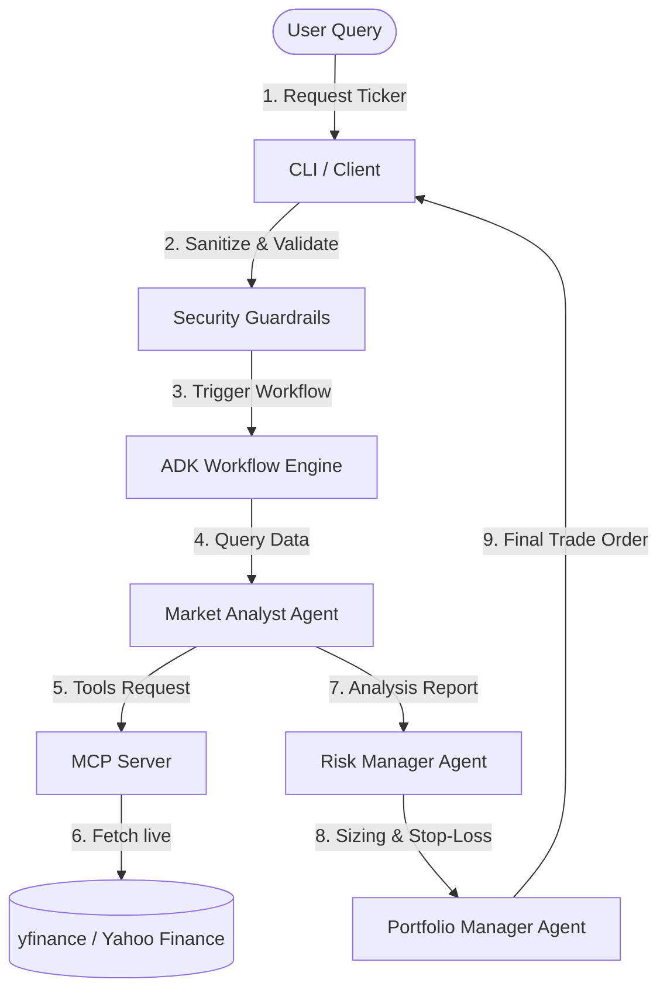

# AI Stock Trading & Market Analysis Agent System

A modular, production-grade AI Agent system developed for the **Kaggle AI Agents Capstone Project (Agents for Business / Concierge Agents Track)**. The system coordinates specialized agents to analyze markets, apply risk parameters, and simulate portfolio decisions, utilizing the Google Agent Development Kit (ADK) and Model Context Protocol (MCP).

---

## Key Features

1. **Multi-Agent Architecture (Google ADK)**:
   - **Market Analyst Agent**: Fetches historical close prices, intraday metrics, technical indicators, and headlines, then outputs a Market Analysis Report.
   - **Risk Manager Agent**: Validates metrics, sets stop-loss/take-profit, assigns risk ratings, and approves/rejects compliance status.
   - **Portfolio Manager Agent**: Aggregates analyst and risk reviews to formulate the final decision (BUY/SELL/HOLD), transaction sizing, and disclaimers.
2. **Standardized Model Context Protocol (MCP)**:
   - Built on `fastmcp` to expose live tools for pricing, indicators, and headlines via stdio transport.
3. **Security Guardrails**:
   - Strictly limits transaction sizes to 5% max.
   - Restricts sizing to 2% max for overbought conditions (RSI > 70).
   - Validates symbol inputs to prevent prompt injection or execution escapes.
4. **Antigravity Integration**:
   - Integrates custom workspace rules (`.agents/AGENTS.md`) and registering skills (`.agents/skills/trading_assistant/SKILL.md`) for the Antigravity TUI/IDE.
5. **Interactive Console CLI**:
   - Outputs colorized, readable reports in the terminal.

---

## Installation & Setup

1. **Clone & Bootstrap**:
   Bootstrap the virtual environment and dependencies using `uv`:

   ```bash
   chmod +x setup.sh
   ./setup.sh
   source .venv/bin/activate
   ```

2. **Configure API Key**:
   Create a `.env` file in the project root:

   ```bash
   cp .env.example .env
   ```

---

## Usage

### 1. Run via ADK CLI (Recommended)

The Google ADK CLI auto-discovers `agents/trading_agent/agent.py`, which exports
`root_agent` (the trading `Workflow`). This is the primary way to run the system.

```bash
source .venv/bin/activate

# Browser playground — select the "trading_agent" agent to see the workflow graph
adk web src/agents

# Headless interactive session
adk run src/agents/trading_agent
```

When prompted, ask e.g. *"Analyze the stock symbol: AAPL."* The Market Analyst
retrieves live data via MCP tools, the Risk Manager validates sizing via the
`enforce_risk_limits` tool, and the Portfolio Manager emits a BUY/SELL/HOLD
decision with the mandatory compliance disclaimer.

**Security guardrails on the ADK path** are enforced programmatically:

- Invalid tickers are blocked before the model runs (`before_model_callback`).
- The compliance disclaimer is appended after the Portfolio Manager responds
  (`after_model_callback`).
- Position sizing is bounded by the `enforce_risk_limits` tool.

### 2. Interactive Trading CLI (Legacy)

Analyzes any stock ticker via a colorized terminal interface with its own
pre/post guardrails (defense in depth with the ADK callbacks):

```bash
python src/cli.py --ticker GOOGL
```

### 3. Run the MCP Server Standalone

Launch the MCP server in `stdio` mode to plug into custom clients (like Claude
Desktop or the Antigravity TUI):

```bash
python src/mcp_server.py
```

### 4. Running via Docker (Alternative)

Build and run the agent system inside a secure, containerized sandbox:

```bash
# Build the image
docker build -t trading-agent .

# Run market analysis
docker run --env GEMINI_API_KEY="your_api_key" trading-agent --ticker TSLA
```

---

## The Pitch — Problem, Solution, Value

### Problem Statement

Retail investors face an overwhelming deluge of market data — prices,
technical indicators, news headlines — and must manually reconcile price
action, risk exposure, and position sizing before placing a trade. Doing
this consistently is error-prone: sizing is often guesswork, stop-losses
are set arbitrarily (or omitted), and there is no enforced compliance
disclaimer. A single chatbot calling a stock API does not solve this; the
sizing and risk steps need *enforced* guardrails, not advisory prose.

### Why Agents?

This problem maps naturally onto a **sequential multi-agent workflow**
where each stage owns one concern and hands a structured report to the
next:

- **Market Analyst** — gathers data (price, RSI/SMA, headlines) via MCP
  tools and produces a Market Analysis Report.
- **Risk Manager** — validates the metrics, sets stop-loss / take-profit
  within an enforced band, and approves or rejects the trade.
- **Portfolio Manager** — aggregates both reports into a final
  BUY / SELL / HOLD decision with position sizing and the mandatory
  disclaimer.

Agents uniquely help here because the risk and compliance steps **must
not be skipped or relaxed**, yet they depend on intermediate structured
output from the analysis step. A workflow with programmatically enforced
tool calls (`enforce_risk_limits`) and callbacks guarantees the safety
bounds are applied every run — something a single prompt cannot assure.

### Architecture

The end-to-end flow is shown in the [Architecture Diagram](#architecture-diagram)
below: the user query is sanitized, the ADK Workflow Engine runs the three
agents in fixed sequence, the Market Analyst fetches live data from the
MCP server (backed by yfinance), and the Portfolio Manager returns the
final order. Guardrails are enforced at **two** layers — ADK callbacks on
the `adk` path and `src/cli.py` pre/post-processing on the legacy path.

### The Build

- **Google ADK** (`google-adk`) — multi-agent orchestration and the
  `adk web` / `adk run` discovery contract (`root_agent` export).
- **fastmcp** — MCP server over stdio exposing price, indicator, and
  news tools (Pydantic output models, TTL-cached, sanitized inputs).
- **yfinance** — live market data source for the MCP tools.
- **uv + Python 3.13** — dependency management; `uv.lock` pins versions.
- **Docker** — containerized sandbox for the legacy CLI (`Dockerfile`).
- **pytest + ruff** — unit/integration split via markers, lint/format.

---

## The Implementation — Architecture & Code

### Fixed workflow order

`market_analyst_agent` -> `risk_manager_agent` -> `portfolio_manager_agent`,
wired as sequential graph edges from `START` in the `trading_workflow`.

### Canonical module

`src/agents/trading_agent/agent.py` is the **single** definition of all
three agents, the workflow, the ADK callbacks, and the `enforce_risk_limits`
tool. `src/workflow.py` is a thin re-export so the legacy `src/cli.py`
path keeps working — agent definitions are **not** duplicated across
files. The ADK CLI auto-discovers `root_agent` from this module.

### MCP toolset

`src/mcp_server.py` runs a `fastmcp` server over stdio exposing
`get_stock_price`, `get_technical_indicators`, and news tools. The Market
Analyst mounts them via `McpToolset` + `StdioServerParameters`. The Risk
Manager does **not** call MCP tools directly — it reads RSI from the
analyst's report, preserving agent separation.

### Guardrail enforcement (dual-layer)

| Rule | ADK path (`adk web` / `adk run`) | Legacy CLI (`src/cli.py`) |
| --- | --- | --- |
| Ticker sanitization | `before_model_callback` blocks invalid input | pre-check before workflow launch |
| 5% cap / 2% RSI>70 / 1.5%–12% stop-loss | `enforce_risk_limits` tool (authoritative) | instruction-only |
| Required disclaimer | `after_model_callback` appends it | `sanitize_and_format_output` post-processing |

Agent instructions are **advisory**; callbacks and tools are
**authoritative**. Both layers must remain functional — see
`CONTEXT.md` for the full enforcement map and file map.

---

## Conventions & Security

See `CONTEXT.md` for the full secure-coding standards, guardrail enforcement
map, and file map. `AGENTS.md` lists the mandatory behavioral rules for any
agent operating in this workspace.

### Quick commands

```bash
make test          # unit tests (offline, no network)
make test-integration  # live yfinance calls
make lint          # ruff check
make web           # adk web playground
make run           # adk run trading_agent
```

---

## Architecture Diagram


